# SolidaryTech — Relatório de Entrega Técnica

Hackathon FIAP — Fase 5 | Equipe DCLT

---

## Equipe

| Integrante | RM | GitHub |
|---|---|---|
| Jailson Vitor Domingos da Silva | RM367527 | JAILSON-ENTERPRISE |
| Pedro Gimenez Miranda Silva | RM368740 | PedroGimenezSilva |
| Diego José de Melo | RM368013 | DiegoMeloDevOps |
| Felipe da Matta | RM367534 | fxshelll |

## Links

| Recurso | URL |
|---|---|
| Repositório Applications | https://github.com/AXMEDUSA/1-DCLT-APPLICATIONS-FASE-5 |
| Repositório GitOps | https://github.com/AXMEDUSA/1-DCLT-GITOPS-FASE-5 |
| Repositório Terraform | https://github.com/AXMEDUSA/1-DCLT-TERRAFORM-FASE-5 |
| Vídeo de Demonstração | https://drive.google.com/file/d/1ZD7awogdzqXjiVXePOQ-DGelB05SDcyf/view?usp=sharing |

---

## Sumário

1. Visão Geral do Projeto
2. Arquitetura
3. Microsserviços
4. Infraestrutura como Código (Terraform)
5. Containers e CI/CD
6. GitOps com ArgoCD
7. Observabilidade
8. SRE — Confiabilidade e Golden Metrics
9. FinOps — Otimização Financeira
10. AIOps e ITSM — Gestão Preditiva de Incidentes
11. Disaster Recovery e Continuidade de Negócios (PCN)
12. Evidências — Dashboard SolidaryTech UI
13. Evidências — Grafana Dashboard

---

## 1. Visão Geral do Projeto

A **SolidaryTech** é uma plataforma sem fins lucrativos que conecta ONGs a doadores e voluntários em todo o Brasil. Após ganhar destaque em rede nacional, a plataforma passou a enfrentar picos de acesso imprevisíveis, exigindo uma arquitetura de microsserviços resiliente, observável e financeiramente sustentável.

### Repositórios

| Repositório | Finalidade |
|---|---|
| 1-DCLT-TERRAFORM-FASE-5 | IaC — provisionamento de toda a infraestrutura Azure |
| 1-DCLT-APPLICATIONS-FASE-5 | Dockerfiles, código-fonte e pipelines CI/CD |
| 1-DCLT-GITOPS-FASE-5 | Manifestos Kubernetes e configuração do ArgoCD |

### Princípios da Regra de Ouro

- **Sem deploy manual via kubectl** — todo deploy passa pelo ArgoCD
- **Sem infraestrutura "clicada" no console** — tudo provisionado via Terraform
- **Sem voo cego** — observabilidade completa com Prometheus, Grafana, Loki e Datadog APM

---

## 2. Arquitetura

```
+-----------------------------------------------------------------------+
|                          Azure — eastus2                              |
|                                                                       |
|  +----------------------------------------------------------------+  |
|  |                      AKS — centralus                           |  |
|  |                                                                |  |
|  |  namespace: solidarytech       namespace: monitoring           |  |
|  |  +---------------------+      +------------------------+      |  |
|  |  | ngo-service         |      | Prometheus             |      |  |
|  |  | Python / Flask      |      | Grafana (3 dashboards) |      |  |
|  |  | PostgreSQL          |      | Loki + Promtail        |      |  |
|  |  +---------------------+      | Datadog Agent          |      |  |
|  |  | donation-service    |      +------------------------+      |  |
|  |  | Go / HTTP           |                                      |  |
|  |  | PostgreSQL + Queue  |      namespace: argocd               |  |
|  |  | HPA: 2-10 replicas  |      +------------------------+      |  |
|  |  +---------------------+      | ArgoCD                 |      |  |
|  |  | volunteer-service   |      | GitOps Controller      |      |  |
|  |  | Python / Flask      |      +------------------------+      |  |
|  |  | CosmosDB (Table)    |                                      |  |
|  |  +---------------------+      namespace: velero               |  |
|  |                               +------------------------+      |  |
|  |                               | Velero                 |      |  |
|  |                               | Backup -> brazilsouth  |      |  |
|  |                               +------------------------+      |  |
|  +----------------------------------------------------------------+  |
|                                                                       |
|  +----------+  +-------------+  +------------------------------+     |
|  | ACR      |  | PostgreSQL  |  | Azure Storage                |     |
|  | acrsolid |  | 3x Flexible |  | Queue: fila-solidarytech     |     |
|  | arytechf5|  | Server      |  | Blob: tfstate + Velero DR    |     |
|  +----------+  +-------------+  +------------------------------+     |
|                                                                       |
|  +----------+  +-------------+                                       |
|  | Redis    |  | CosmosDB    |                                       |
|  | Balanced |  | Table API   |                                       |
|  | B0       |  | Serverless  |                                       |
|  +----------+  +-------------+                                       |
+-----------------------------------------------------------------------+

GitHub Actions --> ACR --> ArgoCD --> AKS
     (CI/CD)            (GitOps)   (cluster)
```

---

## 3. Microsserviços

### 3.1 ngo-service

**Linguagem:** Python 3 / Flask
**Porta:** 8081
**Banco:** PostgreSQL Flexible Server (centralus)
**Função:** Cadastro e gestão das ONGs parceiras da plataforma.

**Endpoints:**

| Método | Rota | Descrição |
|---|---|---|
| GET | /health | Health check — retorna {"status":"ok"} |
| POST | /ngos | Cadastra nova ONG (campos: name, email, cause, city) |
| GET | /ngos | Lista todas as ONGs ordenadas por ID decrescente |

**Recursos no cluster:**

- Deployment: 1 réplica, requests: 100m CPU / 128Mi, limits: 250m / 256Mi
- HPA: min 1, max 5, CPU 70%
- Prometheus annotations para scrape automático (/metrics, porta 8081)
- Datadog APM: variáveis DD_SERVICE, DD_ENV, DD_VERSION injetadas

---

### 3.2 donation-service (Hot Path)

**Linguagem:** Go 1.24
**Porta:** 8082
**Banco:** PostgreSQL Flexible Server (centralus)
**Fila:** Azure Storage Queue (fila-solidarytech)
**Cache:** Redis Managed (Balanced_B0)
**Função:** Processamento das doações — caminho crítico da plataforma. Toda doação é processada aqui, persistida no PostgreSQL e um evento é despachado para a fila de notificações.

**Endpoints:**

| Método | Rota | Descrição |
|---|---|---|
| GET | /health | Health check — retorna {"status":"ok"} |
| POST | /donations | Processa nova doação (campos: ngo_id, amount, donor_name) |
| GET | /donations | Lista todas as doações ordenadas por data |

**Fluxo de processamento:**

```
POST /donations -> valida payload -> INSERT PostgreSQL -> status "APPROVED" -> evento async Azure Storage Queue
```

**Recursos no cluster:**

- Deployment: 2 réplicas mínimas (alta disponibilidade)
- HPA: min 2, max 10, CPU 70% / Memória 75%
- Scale up: +2 pods por minuto (janela 30s)
- Scale down: -1 pod a cada 2 minutos (janela 300s — conservador)
- topologySpreadConstraints: pods distribuídos entre nós distintos
- requests: 250m CPU / 256Mi, limits: 500m / 512Mi
- Datadog APM completo com Distributed Tracing

**SLOs definidos:**

| SLI | Expressão PromQL | SLO |
|---|---|---|
| Taxa de Sucesso | rate(http_requests_total{service="donation-service",status!~"5.."}[5m]) / rate(http_requests_total{service="donation-service"}[5m]) * 100 | >= 99,9% |
| Latência P99 | histogram_quantile(0.99, rate(http_request_duration_seconds_bucket{service="donation-service"}[5m])) | <= 500ms |

---

### 3.3 volunteer-service

**Linguagem:** Python 3 / Flask
**Porta:** 8083
**Banco:** Azure CosmosDB (Table API, Serverless)
**Função:** Match entre voluntários e campanhas das ONGs. Cada voluntário é registrado com um UUID único e associado a uma ONG pelo ngo_id.

**Endpoints:**

| Método | Rota | Descrição |
|---|---|---|
| GET | /health | Health check — retorna {"status":"ok"} |
| POST | /volunteers | Registra novo voluntário (campos: name, email, ngo_id) |
| GET | /volunteers/{ngo_id} | Lista voluntários de uma ONG específica |

**Recursos no cluster:**

- Deployment: 1 réplica, requests: 100m CPU / 128Mi, limits: 250m / 256Mi
- HPA: min 1, max 5, CPU 70%
- Datadog APM: variáveis DD_SERVICE, DD_ENV, DD_VERSION injetadas

---

## 4. Infraestrutura como Código (Terraform)

**Repositório:** 1-DCLT-TERRAFORM-FASE-5
**Provider:** azurerm 4.x
**Backend:** Azure Blob Storage (remote state)
**Região principal:** eastus2 (Resource Group) / centralus (AKS, PostgreSQL)

### Recursos Provisionados

| Arquivo .tf | Recurso | Detalhes |
|---|---|---|
| resourcegroup.tf | Resource Group | rg-solidarytech-fase5 — eastus2 |
| aks.tf | AKS Cluster | aks-solidarytech — centralus, Standard_D2s_v3, 2 nós, CNI Azure |
| acr.tf | Container Registry | acrsolidarytechf5 — SKU Basic |
| postgresql.tf | PostgreSQL x3 | Flexible Server — ngo, donation, volunteer |
| redis.tf | Redis Cache | Balanced_B0 — hot path donation-service |
| cosmo_db.tf | CosmosDB | Table API, Serverless — volunteer-service |
| storage_queue.tf | Storage Queue | fila-solidarytech — eventos de doação |
| storage_account_tfstate.tf | Storage Account | tfstate remoto + blobs Velero DR |
| vnet.tf | VNet + Subnets + Peering | VNet principal + VNet AKS (isolada) |
| private_endpoint.tf | Private Endpoints | PostgreSQL e Redis sem IP público |
| route_table.tf | Route Table | Roteamento interno AKS |

### Política de Tags FinOps

Todos os recursos recebem as tags obrigatórias via local.common_tags:

```hcl
locals {
  finops_tags = {
    Project     = "SolidaryTech"
    Environment = "Production"
    Owner       = "FIAP-Team"
    CostCenter  = "NGO-Core"
    CreatedBy   = "Terraform"
    ManagedBy   = "Terraform"
  }
}
```

Aplicado em: AKS, ACR, PostgreSQL x3, Redis, CosmosDB, Storage Account, VNet.

### Módulo Warm Standby (DR — Opção B)

O Terraform está estruturado para levantar um ambiente espelho em brazilsouth via:

```bash
terraform apply \
  -var="location=brazilsouth" \
  -var="aks_location=brazilsouth" \
  -var="pg_location=brazilsouth"
```

---

## 5. Containers e CI/CD

### Dockerfiles

Todos os serviços usam **build multi-stage** seguindo práticas DevSecOps:

**donation-service (Go):**

```
Stage 1 — builder: golang:1.24-alpine
  -> go mod download -> go build -ldflags="-s -w" (binario otimizado)

Stage 2 — runtime: gcr.io/distroless/static:nonroot
  -> copia apenas o binario -> usuario nonroot:nonroot -> EXPOSE 8082
```

**ngo-service e volunteer-service (Python):**

```
Stage 1 — builder: python:3.12-alpine
  -> pip install -> sem cache

Stage 2 — runtime: python:3.12-alpine (minimo)
  -> copia dependencias -> usuario nao-root -> EXPOSE 808x
```

### Pipelines CI/CD (GitHub Actions)

**Repositório:** 1-DCLT-APPLICATIONS-FASE-5/.github/workflows/

Fluxo de cada pipeline:

```
push na branch main
       |
       v
checkout do codigo
       |
       v
build da imagem Docker (multi-stage)
       |
       v
Trivy scan — filesystem (SAST/SCA)
       |
       v
Trivy scan — imagem final
       |
       v
push para ACR (acrsolidarytechf5.azurecr.io)
       |
       v
commit automatico da nova tag no repo GitOps
       |
       v
ArgoCD detecta mudanca -> sync automatico -> deploy no AKS
```

**Secrets necessários no GitHub:**

| Secret | Uso |
|---|---|
| AZURE_CLIENT_ID | Autenticação no ACR via OIDC |
| AZURE_CLIENT_SECRET | Credencial Azure |
| AZURE_TENANT_ID | Tenant Azure |
| AZURE_SUBSCRIPTION_ID | Subscription Azure |
| GITOPS_TOKEN | Commit automático no repo GitOps |

---

## 6. GitOps com ArgoCD

**Repositório:** 1-DCLT-GITOPS-FASE-5

O ArgoCD monitora este repositório e aplica qualquer mudança automaticamente no cluster, sem intervenção manual.

### AppProject solidarytech

Define as permissões do ArgoCD para o projeto:

- **Source repos permitidos:** GitHub GitOps, Helm charts (prometheus-community, grafana, vmware-tanzu)
- **Namespaces permitidos:** solidarytech, monitoring, velero, kube-system, default
- **Sync policy:** automated + selfHeal + prune

### Applications Registradas

| Application | Chart / Source | Namespace | Sync | Health |
|---|---|---|---|---|
| ngo-service | repo GitOps | solidarytech | Synced | Healthy |
| donation-service | repo GitOps | solidarytech | Synced | Healthy |
| volunteer-service | repo GitOps | solidarytech | Synced | Healthy |
| monitoring-stack | kube-prometheus-stack 65.x | monitoring | Synced | Healthy |
| loki-stack | loki 6.x + promtail 6.x | monitoring | Synced | Healthy |
| grafana-dashboards | repo GitOps (ConfigMap) | monitoring | Synced | Healthy |
| velero | velero 6.7.0 | velero | Synced | Healthy |

### Estrutura de Diretórios

```
1-DCLT-GITOPS-FASE-5/
├── apps/
│   ├── donation-service/
│   │   ├── deployment.yaml     (2 replicas, HPA, Datadog, probes)
│   │   ├── service.yaml        (ClusterIP porta 8082)
│   │   └── hpa.yaml            (min 2 / max 10 / CPU 70%)
│   ├── ngo-service/
│   │   ├── deployment.yaml
│   │   ├── service.yaml
│   │   └── hpa.yaml
│   └── volunteer-service/
│       ├── deployment.yaml
│       ├── service.yaml
│       └── hpa.yaml
├── argocd-apps/
│   ├── app-donation.yaml
│   ├── app-ngo.yaml
│   ├── app-volunteer.yaml
│   ├── app-monitoring.yaml     (kube-prometheus-stack)
│   ├── app-loki.yaml           (Loki + Promtail)
│   ├── app-grafana-dashboards.yaml
│   └── app-velero.yaml
├── infra/
│   ├── argocd/
│   │   └── argocd-install.yaml (AppProject solidarytech)
│   ├── monitoring/
│   │   ├── prometheus-values.yaml
│   │   ├── grafana-values.yaml
│   │   ├── grafana-dashboards-configmap.yaml
│   │   ├── loki-values.yaml
│   │   └── promtail-values.yaml
│   ├── namespace/
│   │   └── namespace.yaml
│   └── velero/
│       └── velero-install.yaml
└── documentacao/
    └── documentacao-solidarytech.md
```

---

## 7. Observabilidade

### Stack Completa — namespace monitoring

| Componente | Versão/Chart | Função |
|---|---|---|
| Prometheus | kube-prometheus-stack 65.x | Coleta de métricas do cluster e dos serviços |
| Grafana | embutido no kube-prometheus-stack | Visualização — 3 dashboards customizados |
| Loki | loki 6.x (SingleBinary) | Agregação de logs dos pods |
| Promtail | promtail 6.x | Coleta de logs e envio ao Loki |
| Datadog Agent | Helm via ArgoCD | APM com Distributed Tracing e Watchdog |

### Coleta de Métricas (Prometheus)

O Prometheus faz scrape dos serviços automaticamente via annotations nos pods:

```yaml
annotations:
  prometheus.io/scrape: "true"
  prometheus.io/port: "8082"
  prometheus.io/path: "/metrics"
```

### Dashboards Grafana

**1. SRE — donation-service (uid: sre-donation)**

- Gauge: Taxa de Sucesso vs SLO 99,9%
- Stat: Error Budget restante (30 dias)
- Time series: Latência P50 / P95 / P99 com linha de threshold em 500ms
- Time series: RPS por status HTTP (2xx / 4xx / 5xx)
- Time series: CPU e Memória dos pods
- Stat: Pods disponíveis
- Time series: Reinicializações (CrashLoop detector)
- Time series: HPA réplicas desejadas vs atuais

**2. SolidaryTech — Overview (uid: solidarytech-overview)**

- RPS dos 3 serviços lado a lado
- Latência P99 dos 3 serviços em um único gráfico
- Taxa de erro dos 3 serviços
- CPU e Memória do namespace completo
- Tabela de status de pods

**3. FinOps — Consumo de Recursos (uid: finops-costs)**

- Bargauge: CPU Request vs Usage (rightsizing visual)
- Bargauge: Memória Request vs Usage
- Histórico 24h de CPU (baseline para rightsizing)
- Gauge: % CPU alocada vs capacidade dos nós
- Gauge: % Memória alocada vs capacidade dos nós

### Alertas (PrometheusRules)

| Alerta | Condição | Severidade |
|---|---|---|
| DonationServiceErrorBudgetBurning | Taxa de erro > 0,1% por 5min | critical |
| DonationServiceHighLatency | P99 > 500ms por 5min | warning |
| DonationServiceDown | up == 0 por 1min | critical |
| PodCrashLooping | Restarts > 0 em 15min | warning |

Alertas são roteados via Alertmanager para o canal Slack #incidentes.

### Coleta de Logs (Loki + Promtail)

O Promtail roda como DaemonSet e coleta logs de todos os pods do namespace solidarytech, enriquecendo com labels: app, namespace, pod e container.

---

## 8. SRE — Confiabilidade e Golden Metrics

### Definições: SLI, SLO e SLA

| Sigla | Definição | Aplicação no SolidaryTech |
|---|---|---|
| SLI (Service Level Indicator) | Métrica mensurável que representa o comportamento real do serviço | Taxa de sucesso das requisições e latência P99 do donation-service |
| SLO (Service Level Objective) | Meta interna de confiabilidade baseada no SLI | >= 99,9% de sucesso e P99 <= 500ms em janela de 30 dias |
| SLA (Service Level Agreement) | Compromisso formal com as ONGs parceiras — se violado gera penalidades e notificações | Disponibilidade mínima de 99,5% mensal com notificação em até 5 minutos em caso de indisponibilidade |

O SLO (99,9%) é propositalmente mais rigoroso que o SLA (99,5%) para que haja margem de segurança operacional antes de impactar as ONGs parceiras.

### SLIs e SLOs do donation-service

O donation-service é o **Caminho Crítico (Hot Path)** da plataforma. Uma falha aqui impede doações — impacto direto nas ONGs parceiras.

**SLI 1 — Taxa de Sucesso**

```promql
rate(http_requests_total{service="donation-service",status!~"5.."}[5m])
/ rate(http_requests_total{service="donation-service"}[5m]) * 100
```

- **SLO:** >= 99,9% das requisições bem-sucedidas em janela de 30 dias
- **SLA:** >= 99,5% de disponibilidade mensal (compromisso com ONGs parceiras)
- **Error Budget:** 0,1% = ~43 minutos de downtime por mês

**SLI 2 — Latência P99**

```promql
histogram_quantile(0.99,
  rate(http_request_duration_seconds_bucket{service="donation-service"}[5m])
)
```

- **SLO:** P99 <= 500ms
- **SLA:** P99 <= 1.000ms (limite contratual com ONGs)
- **Justificativa:** Uma doação deve ser processada em menos de meio segundo para garantir boa experiência ao doador.

### Error Budget

O Error Budget é calculado em tempo real no dashboard Grafana:

```promql
(1 - (
  sum(increase(http_requests_total{service="donation-service",status=~"5.."}[30d]))
  / sum(increase(http_requests_total{service="donation-service"}[30d]))
)) / (1 - 0.999) * 100
```

Quando o Error Budget cai abaixo de 10%, o alerta DonationServiceErrorBudgetBurning dispara com severidade critical.

### MTTR (Mean Time To Recovery)

| Etapa | Ferramenta | Tempo estimado |
|---|---|---|
| Detecção | Prometheus -> Alertmanager | 1–5 min |
| Notificação | Slack #incidentes + Datadog Watchdog | < 1 min |
| Diagnóstico | Grafana APM + Loki logs + Datadog traces | 3–8 min |
| Mitigação | HPA auto-escala / ArgoCD selfHeal | automático |
| Resolução | Rollback via GitOps (commit no repo) | 2–5 min |
| **MTTR total** | | **~15 min** |

---

## 9. FinOps — Otimização Financeira

### Rightsizing dos Pods

Os recursos foram dimensionados com base nas Golden Metrics dos serviços:

| Serviço | CPU Request | CPU Limit | Mem Request | Mem Limit | Justificativa |
|---|---|---|---|---|---|
| donation-service | 250m | 500m | 256Mi | 512Mi | Hot path — Go compilado, alta concorrência |
| ngo-service | 100m | 250m | 128Mi | 256Mi | Carga baixa — CRUD simples |
| volunteer-service | 100m | 250m | 128Mi | 256Mi | Carga baixa — CosmosDB serverless |

### Forecast de Custos Mensais (Azure — centralus/eastus2)

| Recurso | Configuração | Custo estimado/mês |
|---|---|---|
| AKS — 2 nós Standard_D2s_v3 | centralus | ~$140 |
| PostgreSQL Flexible x3 | B1ms, centralus | ~$45 |
| Redis Cache | Balanced_B0 | ~$15 |
| CosmosDB | Table API, Serverless | ~$5–20 |
| ACR | Basic | ~$5 |
| Storage Account | LRS, hot tier | ~$5 |
| **Total estimado** | | **~$215–230/mês** |

### Recomendações de Economia

1. **Spot Nodes para ngo-service e volunteer-service:** migrar os serviços de menor criticidade para node pool spot — economia de ~60% no custo de VM (~$84/mês)
2. **CosmosDB Serverless:** já está em uso — ideal para cargas imprevisíveis sem custo fixo
3. **ACR Basic:** suficiente para o volume atual; evitar upgrade para Standard desnecessariamente
4. **HPA conservador no scale-down:** janela de 300s evita thrashing e garante escalar para baixo após picos

---

## 10. AIOps e ITSM — Gestão Preditiva de Incidentes

### Funcionalidades de AIOps (Datadog)

- **Watchdog:** detecção automática de anomalias comportamentais sem configuração manual — identifica desvios em latência, taxa de erro e throughput
- **APM Anomaly Detection:** modelo de baseline automático para o donation-service — alerta quando o comportamento sai do padrão histórico
- **Distributed Tracing:** rastreamento de uma requisição do início ao fim, cruzando todos os serviços

### Fluxo de Vida de um Incidente (ITSM)

**1. DETECÇÃO**

- Prometheus detecta violação de SLO
- Datadog Watchdog detecta anomalia comportamental

**2. ALERTA**

- Alertmanager envia notificação para Slack #incidentes (< 1 min)
- Datadog Monitor cria incidente automaticamente

**3. TRIAGEM (on-call acionado)**

- Grafana: dashboard SRE mostra Error Budget consumido
- Datadog APM: trace da requisição com falha identificado
- Loki: logs do pod no momento do erro

**4. MITIGAÇÃO AUTOMÁTICA**

- HPA escala donation-service (se causa for carga)
- ArgoCD selfHeal corrige drift de configuração
- Kubernetes liveness probe reinicia pod travado

**5. RESOLUÇÃO**

- Correção via commit no repo GitOps
- ArgoCD detecta e aplica em < 2 min
- Alerta resolvido automaticamente (resolve_timeout: 5min)

**6. POST-MORTEM**

- Documento no Datadog Incident (causa raiz + timeline + ações)
- PrometheusRule ajustada se necessário

**7. COMUNICAÇÃO**

- Status page atualizado
- Comunicado às ONGs parceiras via e-mail

---

## 11. Disaster Recovery e Continuidade de Negócios (PCN)

**Versão:** 1.0 | **Data:** 2026-06-15 | **Classificação:** Executivo

### 11.1 Objetivo

Este documento define as diretrizes, procedimentos e métricas de recuperação para garantir a continuidade operacional da plataforma SolidaryTech em cenários de falha parcial ou total da infraestrutura. O foco principal é o **donation-service**, classificado como Caminho Crítico (Hot Path) da operação.

### 11.2 Escopo

| Serviço | Criticidade | Banco de Dados |
|---|---|---|
| donation-service | CRITICO — Hot Path | PostgreSQL (Azure Database) |
| ngo-service | Alta | PostgreSQL (Azure Database) |
| volunteer-service | Média | Azure Cosmos DB |

### 11.3 Objetivos de Recuperação (RTO e RPO)

**Valores críticos — donation-service:**

| Métrica | Valor | Justificativa |
|---|---|---|
| RTO (Recovery Time Objective) | 15 minutos | Tempo máximo tolerável sem processar doações |
| RPO (Recovery Point Objective) | 1 hora | Máximo de dados de doações que podem ser perdidos |

**Valores complementares por serviço:**

| Serviço | RTO | RPO |
|---|---|---|
| donation-service | 15 min | 1h |
| ngo-service | 30 min | 24h |
| volunteer-service | 60 min | 24h |

### 11.4 Cenários de Falha e Estratégias

| Cenário | Probabilidade | Estratégia de Resposta | RTO Esperado |
|---|---|---|---|
| Pod crashando | Alta | Liveness probe + restart automático (Kubernetes) | < 1 min |
| Nó do AKS com falha | Média | topologySpreadConstraints + novo nó via VMSS | 3–5 min |
| Falha de deployment | Média | ArgoCD selfHeal reverte para último estado Git | < 2 min |
| Região Azure indisponível | Baixa | Velero restore em nova região | ~15 min |
| Corrupção de dados no PostgreSQL | Baixa | Backup geo-redundante + restore | ~30–60 min |

### 11.5 Estratégia DR — Opção A: Cross-Region Backup com Velero

O Velero está instalado no cluster AKS via ArgoCD e configurado para backup automático:

- **Frequência:** diária às 02:00 UTC
- **Escopo:** namespace solidarytech completo (manifestos Kubernetes + volumes PVC)
- **Destino:** Azure Blob Storage (stsolidarytechvelero) — região brazilsouth
- **Retenção:** 30 dias (720h)

**Schedule configurado:**

```yaml
schedule: "0 2 * * *"
includedNamespaces: [solidarytech]
ttl: 720h0m0s
```

**Procedimento de restore:**

```bash
velero backup get
velero restore create restore-$(date +%Y%m%d%H%M) --from-backup <nome-do-backup>
velero restore describe <nome-do-restore>
kubectl get pods -n solidarytech
```

### 11.6 Estratégia DR — Opção B: Warm Standby via Terraform

O Terraform está parametrizado para levantar um ambiente espelho em outra região com um único comando:

```bash
terraform apply \
  -var="location=brazilsouth" \
  -var="aks_location=brazilsouth" \
  -var="pg_location=brazilsouth"
```

O PostgreSQL do donation-service está configurado com geo_redundant_backup_enabled = true, garantindo replicação automática dos dados para a região secundária.

### 11.7 Camadas de Resiliência Implementadas

**Alta Disponibilidade no Cluster:**

- HPA (Horizontal Pod Autoscaler): escala automática baseada em CPU/memória
- topologySpreadConstraints: pods distribuídos entre nós diferentes do AKS
- Liveness e Readiness Probes: detecção e reinício automático de pods com falha
- Resource Limits: requests e limits definidos para todos os containers

**GitOps com Self-Healing:**

- ArgoCD selfHeal: qualquer desvio do estado desejado (Git) é corrigido automaticamente em < 2 minutos
- Rollback automático: basta reverter o commit no repositório GitOps

**Banco de Dados:**

- PostgreSQL Flexible Server com geo_redundant_backup_enabled = true
- Backups automáticos diários gerenciados pela Azure
- Azure Cosmos DB para volunteer-service com replicação nativa

### 11.8 Comunicação em Incidentes

| Fase | Ação | Responsável |
|---|---|---|
| Detecção | Alerta automático via Datadog Watchdog | Sistema |
| Triagem (< 5 min) | Análise no Grafana + Loki + Datadog APM | On-call |
| Contenção (< 15 min) | Rollback via Git ou restore Velero | Engenharia |
| Comunicação | Notificação às ONGs parceiras afetadas | Produto |
| Post-Mortem | Documento com causa raiz, timeline e ações | Engenharia |

### 11.9 Responsáveis

| Papel | Responsabilidade |
|---|---|
| Engenharia de Plataforma | Manutenção do cluster, backups e pipelines |
| SRE | Monitoramento contínuo, SLOs e resposta a incidentes |
| Produto | Comunicação externa com ONGs e doadores |

---

## 12. Evidências — Dashboard SolidaryTech UI

**Nota:** O Dashboard SolidaryTech UI é uma aplicação frontend criada pela equipe por iniciativa própria — não foi solicitada no escopo do trabalho. Decidimos desenvolvê-la para facilitar a visualização e os testes dos microsserviços em tempo real, tornando as evidências mais claras e a experiência de avaliação mais intuitiva. Ela está hospedada no próprio cluster AKS, no namespace solidarytech-ui.

### 12.1 Visão Geral — Todos os Serviços Online

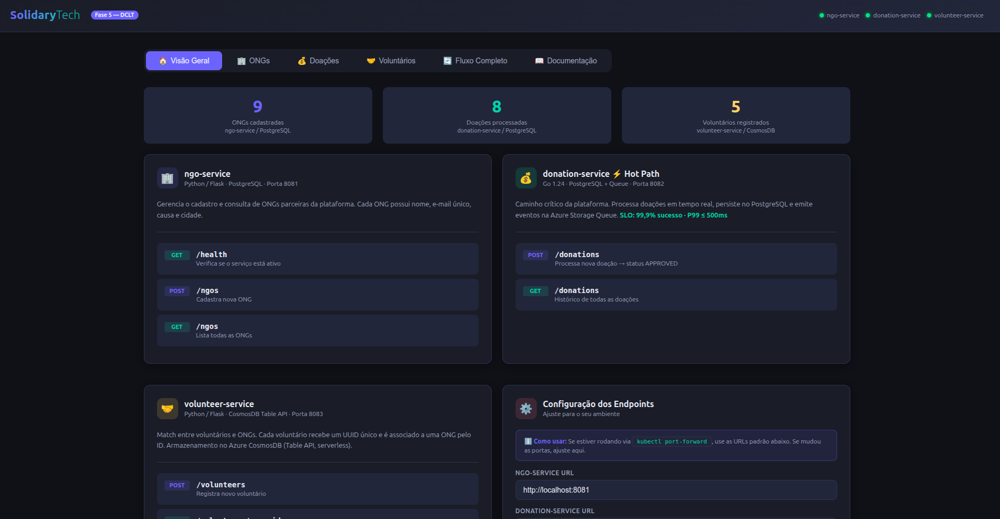

*Dashboard principal: contadores em tempo real — 9 ONGs (PostgreSQL), 8 Doações (PostgreSQL) e 5 Voluntários (CosmosDB). Todos os 3 indicadores de health check verdes.*

### 12.2 Status dos Serviços

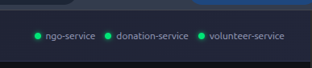

*Indicadores de status — ngo-service, donation-service e volunteer-service todos online.*

### 12.3 Gestão de ONGs (ngo-service / PostgreSQL)

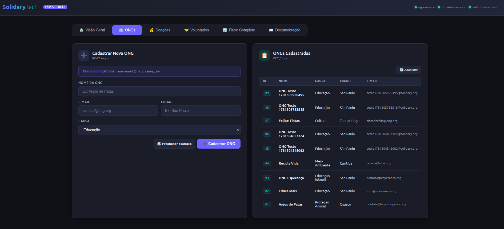

*Aba ONGs: formulário de cadastro e lista das ONGs cadastradas no PostgreSQL. Dados reais: Anjos de Patas, Educa Mais, ONG Esperança, Recicla Vida.*

### 12.4 Processamento de Doações (donation-service / PostgreSQL)

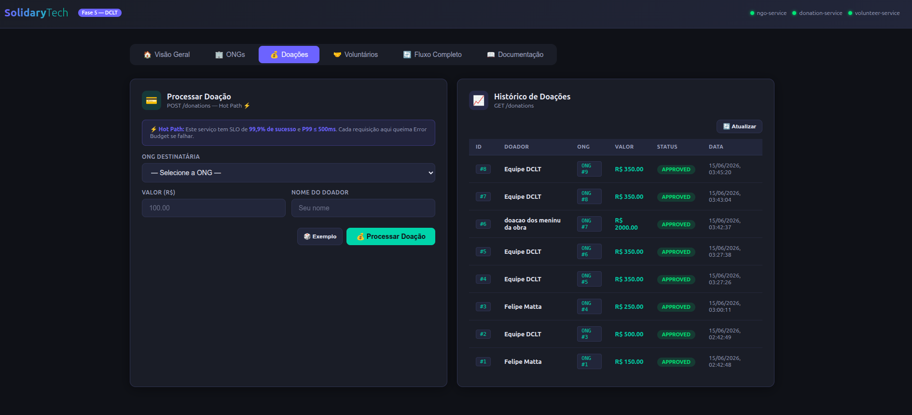

*Aba Doações: histórico completo de transações. Todas as doações com status APPROVED, persistidas no PostgreSQL via donation-service (Go).*

### 12.5 Registro de Voluntários (volunteer-service / CosmosDB)

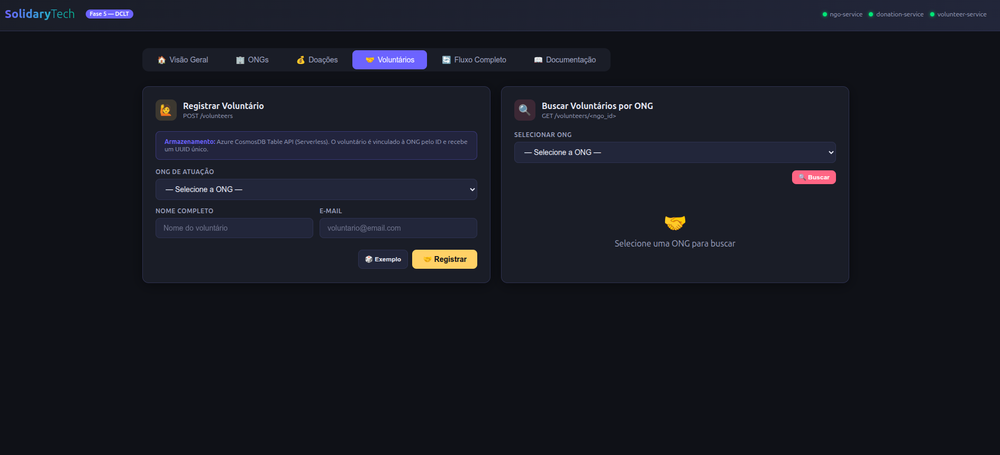

*Aba Voluntários: formulário de registro e busca por ONG. Armazenamento no Azure CosmosDB Table API Serverless.*

### 12.6 Fluxo End-to-End — 5 Passos com Sucesso

O teste de fluxo completo executa automaticamente em sequência: Criar ONG → Processar Doação → Registrar Voluntário → Validar persistência → Confirmar histórico.

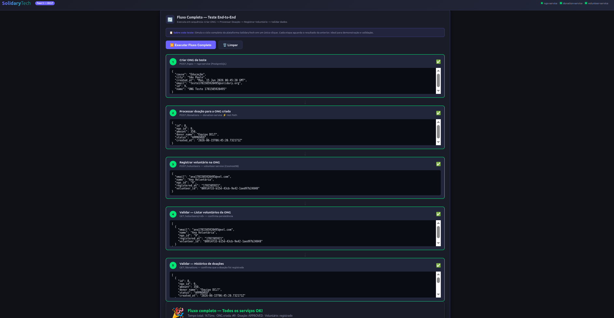

*Fluxo End-to-End completo com todos os 5 passos concluídos. Tempo total: 1675ms. Todos os serviços OK.*

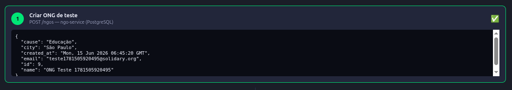

*Passo 1: POST /ngos — ONG criada no PostgreSQL com ID #9, nome "ONG Teste", causa "Educação", cidade "São Paulo".*

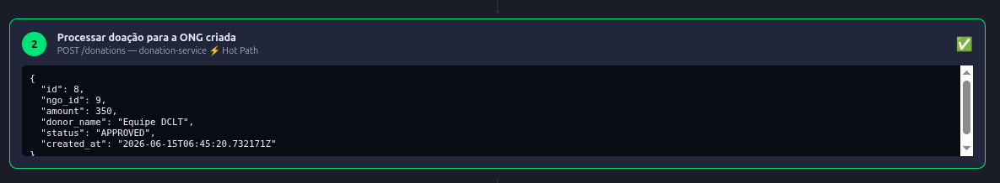

*Passo 2: POST /donations — Doação #8 processada para a ONG #9, valor R$350, status APPROVED imediato pelo donation-service (Go).*

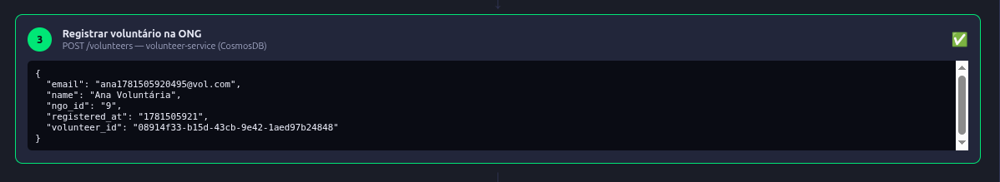

*Passo 3: POST /volunteers — Voluntária "Ana Voluntária" registrada no CosmosDB com UUID único, vinculada à ONG #9.*

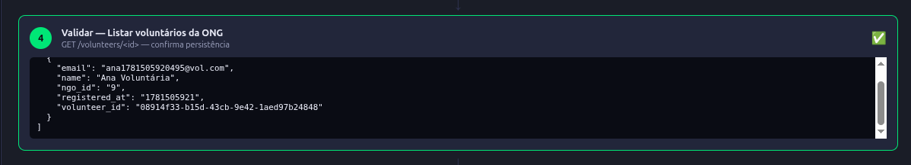

*Passo 4: GET /volunteers/9 — Consulta ao CosmosDB confirma que o voluntário foi persistido corretamente.*

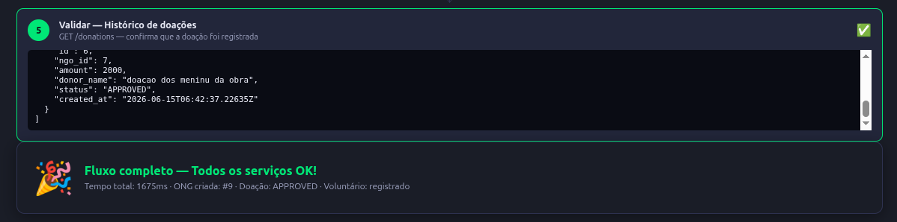

*Passo 5: GET /donations — Histórico confirma que a doação foi registrada. Validação cruzada entre donation-service e o banco PostgreSQL.*

### 12.7 Documentação Inline (API Reference)

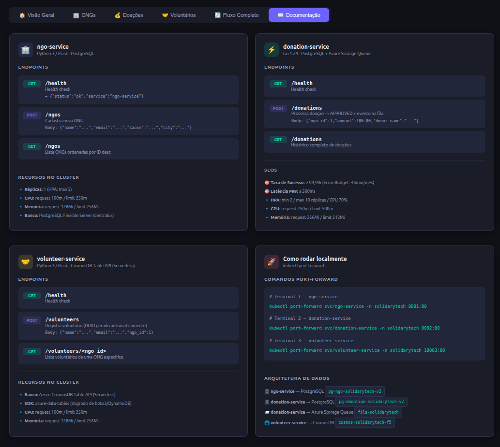

*Aba Documentação: referência completa da API de todos os 3 serviços inline no dashboard, com endpoints, exemplos de payload e SLOs.*

---

## 13. Evidências — Grafana Dashboards

### 13.1 Overview — Pods, Réplicas, CPU e Memória

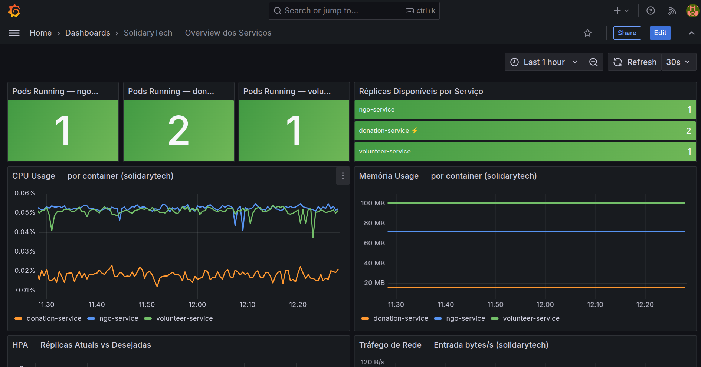

*Painel superior: Pods Running (ngo: 1, donation: 2, volunteer: 1), Réplicas Disponíveis por Serviço, CPU Usage e Memória Usage por container — todos os serviços saudáveis.*

### 13.2 HPA, Tráfego de Rede e Rightsizing

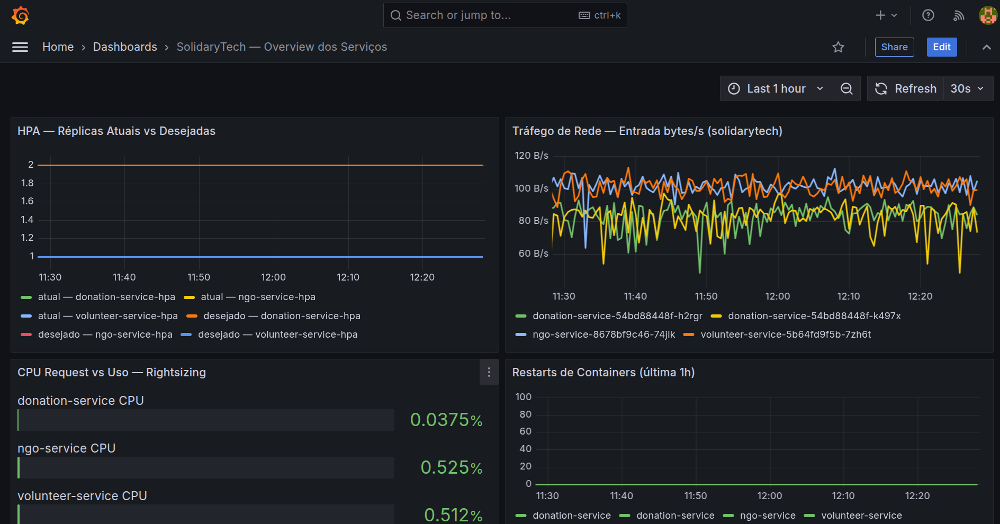

*Painel inferior: HPA — Réplicas Atuais vs Desejadas (donation-service escalado para 2), Tráfego de Rede, CPU Request vs Uso (Rightsizing) e Restarts de Containers (0 restarts).*

### 13.3 Status dos Pods — Tabela

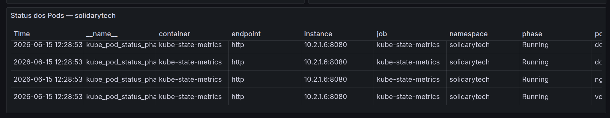

*Tabela de Status dos Pods: todos os pods do namespace solidarytech com fase Running, coletados via kube_pod_status_phase do kube-state-metrics.*

---

## 14. Evidências — Velero Backup e Restore

### 14.1 Backups Existentes no Cluster

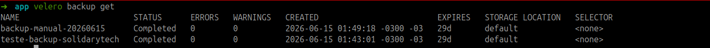

*Comando velero backup get mostrando 2 backups completados armazenados no Azure Blob Storage.*

### 14.2 Criação de Novo Backup

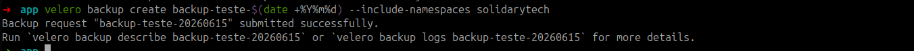

*Backup submetido com sucesso — enfileirado para execução.*

### 14.3 Backup Confirmado como Completed

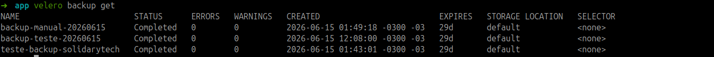

*Três backups com status Completed — novo backup incluído na lista.*

### 14.4 Restore Iniciado

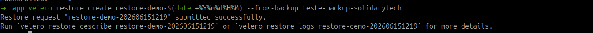

*Restore criado a partir do backup teste-backup-solidarytech.*

### 14.5 Restore — 37/37 Itens Restaurados

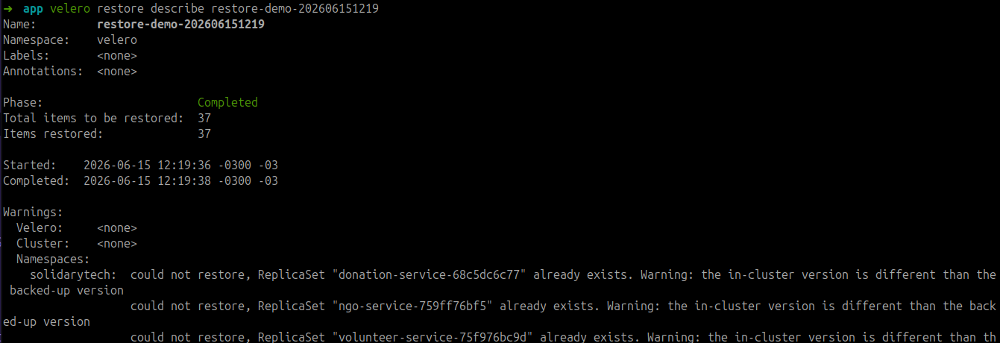

*Phase: Completed — 37 itens restaurados em 2 segundos (12:19:36 a 12:19:38). Warnings referentes a ReplicaSets já existentes são esperados em restore in-place.*

### 14.6 Logs do Restore

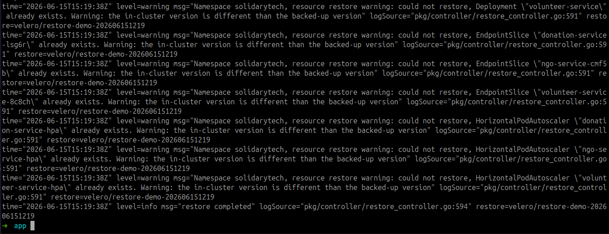

*Logs detalhados do restore mostrando os recursos restaurados no namespace solidarytech.*

### 14.7 Schedule de Backup Diário Ativo

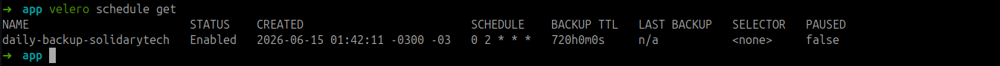

*Schedule daily-backup-solidarytech com cron 0 2 * * * (02h UTC), TTL 720h (30 dias), status Enabled.*

### 14.8 Lista de Restores Executados

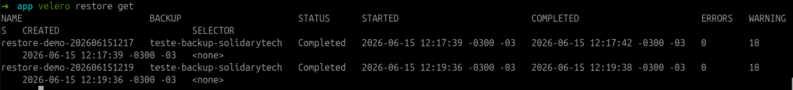

*Dois restores completados com 0 erros, confirmando RTO inferior a 1 minuto para restore completo do namespace solidarytech.*
